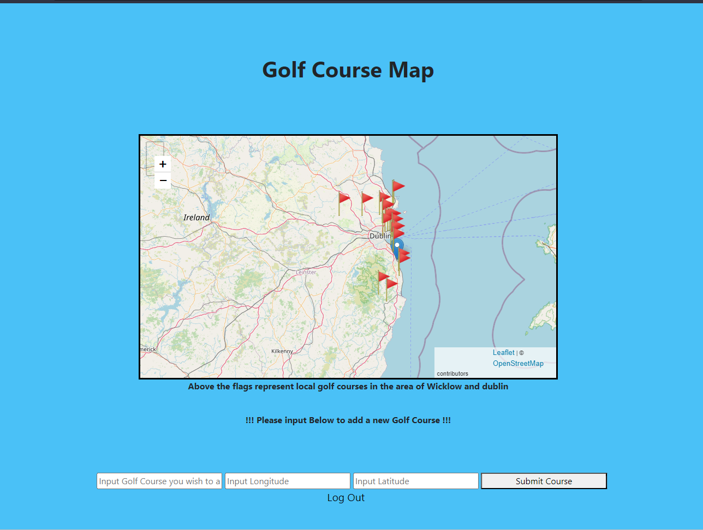

# GeoDjango_AWMAssignmentCA1

Below is the link to the website for this assignment
https://advancedwebmapping.shop/

The username is: User,
The password is: Password

This website using a csv containing the location aka longitude and latitude of golf courses in the wicklow and dublin area.

This data is then inputted into the docker container database and then used by the application and displayed using a leaflet map. The website also gives the user the option to input their own golf course using the name and its coordinates and when the page refreshs it then displays a marker to where the coordinates that were entered are

Below is the image of the map/home page of the website which you will see once you have successfully logged into the website

As you can see in this image you can view all the markers that have been placed on the locations of the golf courses from the database and when you add your own using the input form that new marker will display on the coordinates that you have entered

